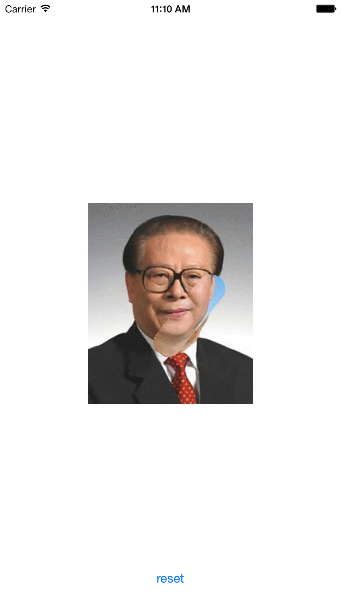

# RubAndReveal

RubAndReveal is a iOS library for you to create the effect of rubbing/wiping a front layer of image to reveal the back image.



## Installation

### Using CocoaPods

    pod 'RubAndReveal', '~> 0.1.1'
    
    
### Usage

**Objective-C**

  - instantiate the RubAndReveal view
  
  ```objc
    RubAndReveal *demoView = [[RubAndReveal alloc] init];
  ```
  - configure the frame of the view
  
  - set the image
  
  ```objc
    [demoView configureLayoutWithBackImage:backImage
                                frontImage:frontImage];
  ```
  - add to subview
  
  ```objc
    [self.view addSubview demoView];
  ```
  
  - reset image if you want
  
  ```objc
    [demoView resetImage];
  ```
  
**Swift**

  - instantiate the RubAndReveal view
  
  ```swift
    let demoView = RubAndReveal()
  ```
  
  - configure the frame of the view
  
  - set the image
  
  ```swift
    demoView.configureLayoutWithBackImage(backImage, frontImage: frontImage)
  ```
  - add to subview
  
  ```swift
    self.view.addSubview(demoView)
  ```
  - reset image if you want
  
  ```swift
    demoView.resetImage()
  ```
  
### Customization
you can change these properties for the ``RubAndReveal`` view
  - ``NSString *lineCap``: it specifies the shape of the endpoints of an open path when rub
  - ``NSString *lineJoin``: it specifies the style for join of the rubbing path
  - ``CGFloat lineWidth``: it specifies the width of the rubbing stroke
